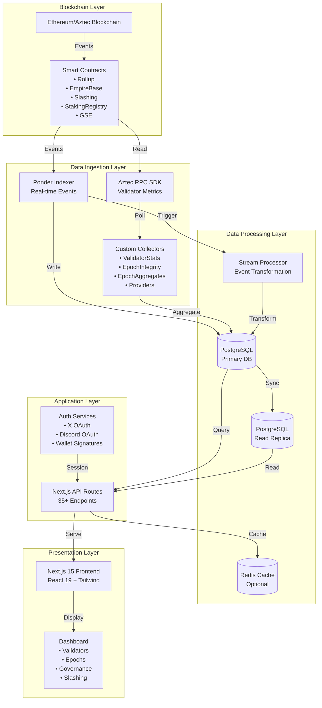
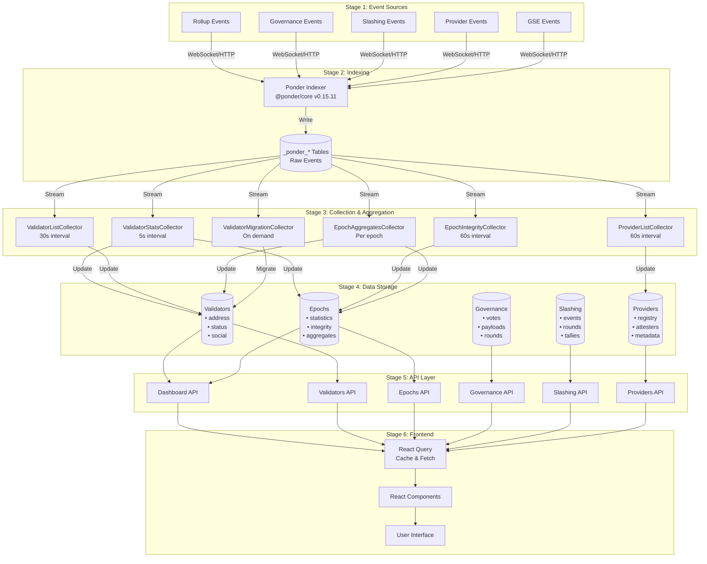
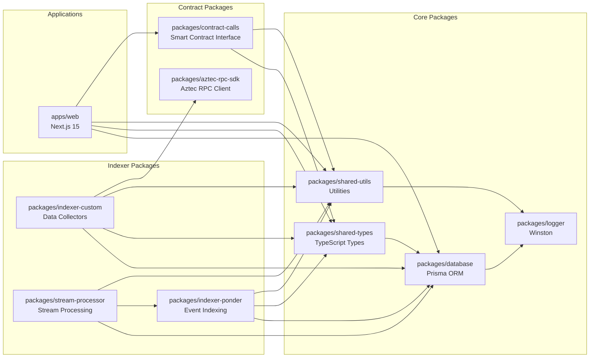
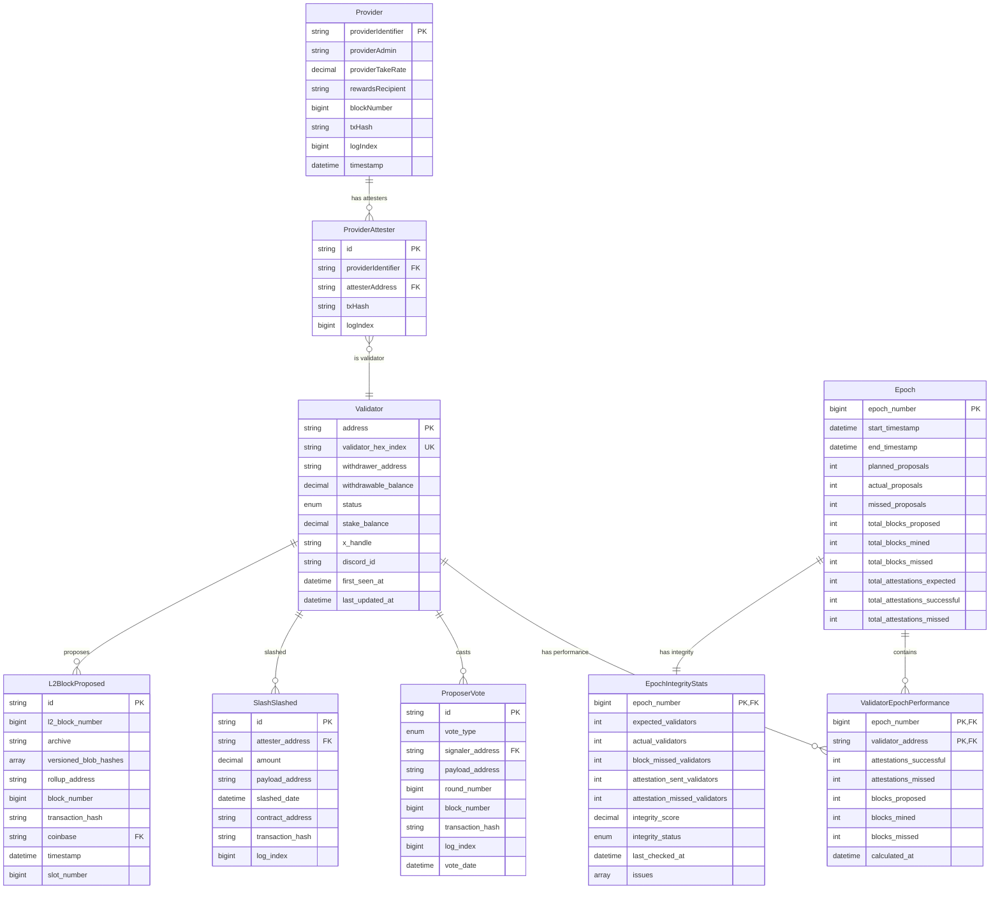
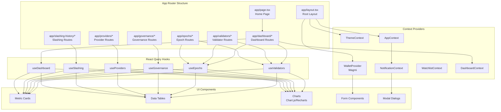
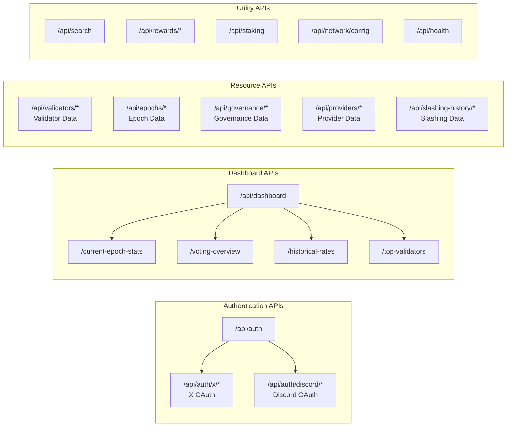
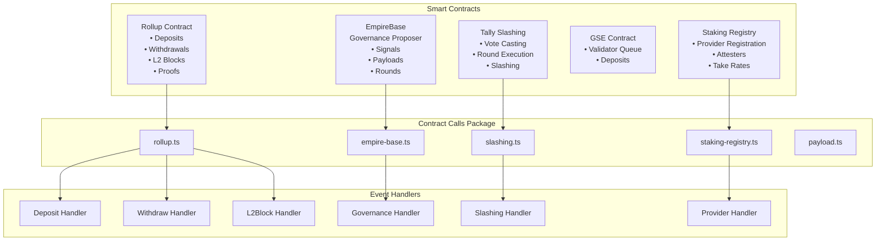
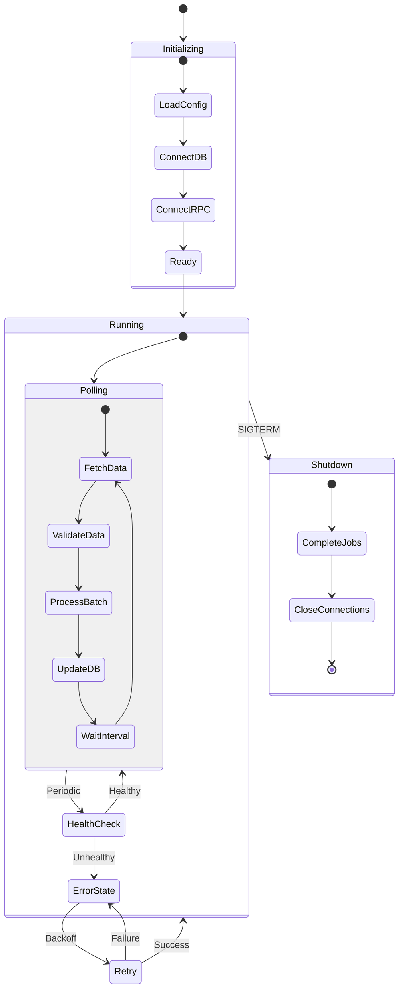

# Dashtec Monorepo - Comprehensive Architecture Analysis

## Executive Summary

The Dashtec monorepo is a sophisticated, production-grade blockchain monitoring platform built as a pnpm workspace-based monorepo managed with Turbo. It provides comprehensive monitoring for Aztec sequencer performance, validator statistics, governance activity, and provider operations through a multi-layered architecture with real-time data indexing, custom aggregation, and a modern React frontend.

## Table of Contents

1. [Overall Monorepo Structure](#1-overall-monorepo-structure)
2. [Main Applications and Packages](#2-main-applications-and-packages)
3. [Key Architectural Patterns](#3-key-architectural-patterns)
4. [Data Flow and Dependencies](#4-data-flow-and-dependencies)
5. [Database Schema](#5-database-schema)
6. [API Structure](#6-api-structure)
7. [Smart Contract Integration](#7-smart-contract-integration)
8. [Frontend Architecture](#8-frontend-architecture)
9. [Backend Services](#9-backend-services)
10. [Configuration and Deployment](#10-configuration-and-deployment)
11. [Data Pipeline Architecture](#11-data-pipeline-architecture)
12. [Governance Features](#12-governance-features)
13. [Architecture Diagrams](#13-architecture-diagrams)

---

## 1. Overall Monorepo Structure

```
dashtec-monorepo/
├── apps/
│   └── web/                      # Next.js 15 frontend application
├── packages/
│   ├── database/                 # Prisma ORM & database layer
│   ├── shared-types/             # Shared TypeScript type definitions
│   ├── shared-utils/             # Utility functions and helpers
│   ├── logger/                   # Winston-based logging
│   ├── indexer-ponder/           # Event-based blockchain indexer
│   ├── indexer-custom/           # Custom data collectors & aggregators
│   ├── contract-calls/           # Smart contract interaction layer
│   ├── stream-processor/         # Stream processing utilities
│   └── aztec-rpc-sdk/            # Aztec blockchain RPC SDK (git subtree)
├── services/
│   └── sentinel-proxy-go/        # Go-based proxy service
├── scripts/                      # Deployment and setup scripts
├── k8s/                          # Kubernetes deployment configs
└── .environment/                 # Network-specific configurations
```

### Key Technologies

- **Package Manager:** pnpm v9.0.0+
- **Build System:** Turbo v2.6.3
- **Runtime:** Node.js v20.0.0+
- **Language:** TypeScript v5.9.3 (ES modules throughout)
- **Frontend:** React 19 + Next.js 15
- **Database:** PostgreSQL + Prisma v7.0.0
- **Blockchain:** Viem v2.31.6 + Wagmi v2.19.2

---

## 2. Main Applications and Packages

### Apps

#### apps/web - Next.js Dashboard Application

- **Type:** Full-stack Next.js 15 application
- **Purpose:** Primary user-facing dashboard for monitoring sequencer performance and network metrics
- **Key Dependencies:**
  - React 19 + React Query v5.90.7
  - Tailwind CSS v4.1.8 with custom plugins
  - Framer Motion v12.15.0 (animations)
  - Wagmi v2.19.2 (Web3 wallet integration)
  - Viem v2.31.6 (Ethereum interaction)
  - Chart.js + Recharts (data visualization)
  - Iron Session v8.0.1 (session management)

**Core Features:**
- Validator monitoring and performance tracking
- Epoch management and historical trends
- Governance proposals and voting tracking
- Slashing history and events
- Provider management dashboard
- Social account linking (X/Discord)
- Validator queue management
- Watchlist functionality

### Packages

#### packages/database - Shared Data Layer

- **ORM:** Prisma v7.0.0 with PostgreSQL adapter
- **Architecture:** Singleton pattern with read-replica support
- **Database Models:**
  - **Validators:** Core validator data, social profiles, status tracking
  - **Epochs:** Epoch statistics, integrity tracking, performance aggregates
  - **Governance:** Proposer votes, payload tracking, governance events
  - **Providers:** Provider registration, attesters, metadata
  - **Slashing:** Slashing events, tally votes, round execution
  - **Blocks:** L2 block proposals with coinbase tracking
  - **System:** Auth challenges, error logs, stream processor checkpoints

#### packages/shared-types - Type Definitions

Central location for all TypeScript interfaces, exporting:
- Validators type definitions
- Epochs specifications
- Proposers contract types
- ABIs for all smart contracts
- Shared validation schemas

#### packages/shared-utils - Utility Functions

- Formatters (number, address, time formatting)
- Validators (address, signature validation)
- Contract utilities
- Logger factory
- RPC utilities
- Cache utilities
- Epoch integrity calculations

#### packages/logger - Centralized Logging

Winston v3.17.0 based logging system with structured logging and context support, used across all services and applications.

#### packages/indexer-ponder - Real-time Event Indexer

- **Framework:** Ponder v0.15.11 (blockchain event indexing)
- **Purpose:** Real-time indexing of on-chain events
- **Contracts Indexed:**
  1. Rollup Contract: Deposits, withdrawals, failed deposits, L2 proof verification, block proposals
  2. Governance Proposer (EmpireBase): Proposal votes, payload submissions
  3. Slashing Proposer: Slashing votes and execution
  4. Tally Slashing Proposer: Vote casting, round execution
  5. GSE Contract: Validator deposits with instance tracking
  6. Staking Registry: Provider registration, attestations, take rates

#### packages/indexer-custom - Custom Data Collectors

Background services for data aggregation and processing:
1. **ValidatorStatsCollector** - Fetches validator performance stats from RPC
2. **ValidatorListCollector** - Maintains current validator roster
3. **EpochIntegrityCollector** - Calculates epoch integrity scores
4. **EpochAggregatesCollector** - Aggregates epoch performance metrics
5. **ValidatorMigrationCollector** - Handles validator data migrations
6. **ProviderListCollector** - Syncs provider metadata

#### packages/contract-calls - Smart Contract Interface Layer

Type-safe contract interaction layer for:
1. empire-base (Governance)
2. rollup (Staking/Rollup)
3. payload (Proposal payloads)
4. slashing (Slashing factory)
5. staking-registry (Provider staking)
6. erc20 (Token interactions)

#### packages/stream-processor - Stream Processing

Real-time processing of Ponder events with Drizzle ORM integration and PostgreSQL connectivity.

#### packages/aztec-rpc-sdk - Aztec Blockchain SDK

Git subtree for Aztec RPC interactions, providing validator stats retrieval, epoch and slot information, and network configuration queries.

---

## 3. Key Architectural Patterns

### Architectural Patterns

1. **Monorepo Pattern (pnpm workspaces)**
   - Isolated packages with dependency management
   - Shared dependencies via workspace protocols
   - Turbo-orchestrated builds

2. **Layered Architecture**
   - Presentation Layer: Next.js frontend components
   - API Layer: 35+ REST endpoints in Next.js API routes
   - Business Logic: Services in apps/web/src/services
   - Data Access: Prisma models and database queries
   - Blockchain Interaction: Viem + contract-calls

3. **Collector/Aggregator Pattern**
   - Multiple independent collectors running parallel
   - Event-driven updates from Ponder
   - Cron-based aggregation jobs
   - Health monitoring per collector

4. **Repository/Query Pattern**
   - Database queries isolated in `/db/queries`
   - Reusable query builders
   - Type-safe query results

5. **Service Layer Pattern**
   - Authentication (OAuth X/Discord, signatures)
   - Contract interactions (RPC calls)
   - Error handling and logging
   - Validation and props generation

6. **React Context + React Query**
   - Global state management (theme, wallet, notifications, dashboard)
   - Server state management with TanStack React Query
   - Custom hooks for data fetching

### Technology Stack Details

**Frontend:**
- React 19 (latest)
- Next.js 15 with App Router
- Tailwind CSS 4 (PostCSS v4)
- Framer Motion for animations
- Wagmi + Viem for blockchain interaction
- React Query for server state
- Chart.js + Recharts for visualization

**Backend:**
- Node.js 20
- Next.js API routes (35+ endpoints)
- Express v5.1.0 (in indexer-custom)
- Hono v4.10.6 (in indexer-ponder)

**Blockchain:**
- Viem v2.31.6 (Ethereum client)
- Wagmi v2.19.2 (React hooks for Web3)
- Iron Session v8.0.1 (SIWE-like authentication)
- Signature verification via Viem

**Data & State:**
- PostgreSQL 14+
- Prisma v7.0.0 (ORM)
- Redis (optional, for caching)
- Ponder v0.15.11 (blockchain indexer)

---

## 4. Data Flow and Dependencies

### High-Level Data Flow

```
Blockchain Events
    ↓
Ponder Indexer (packages/indexer-ponder)
    ↓ (Event handlers write to PostgreSQL)
Ponder Tables (_ponder_*)
    ↓
Stream Processor (packages/stream-processor)
    ↓ (Transform & aggregate)
PostgreSQL (packages/database)
    ↓
Custom Collectors (packages/indexer-custom)
    ├─ ValidatorStatsCollector (pulls from Aztec RPC)
    ├─ ValidatorListCollector (syncs validator list)
    ├─ EpochIntegrityCollector (calculates integrity)
    ├─ EpochAggregatesCollector (aggregates metrics)
    ├─ ProviderListCollector (syncs providers)
    └─ ValidatorMigrationCollector (data migration)
    ↓ (Updates aggregate tables)
PostgreSQL Aggregate Tables
    ↓
API Routes (apps/web/src/app/api/)
    ↓ (REST endpoints)
Frontend Components
    ↓ (React Query fetching)
Web Dashboard (React 19 + Tailwind)
```

### Package Dependencies

```
apps/web
  ├─ @dashtec/contract-calls
  ├─ @dashtec/database
  ├─ @dashtec/shared-types
  ├─ @dashtec/shared-utils
  └─ (external: react, wagmi, viem, etc.)

packages/indexer-custom
  ├─ @dashtec/aztec-rpc-sdk
  ├─ @dashtec/database
  ├─ @dashtec/shared-types
  └─ @dashtec/shared-utils

packages/indexer-ponder
  ├─ @dashtec/database
  ├─ @dashtec/shared-types
  └─ @dashtec/shared-utils

packages/contract-calls
  ├─ @dashtec/shared-types
  └─ @dashtec/shared-utils

packages/stream-processor
  ├─ @dashtec/database
  ├─ @dashtec/indexer-ponder
  └─ @dashtec/shared-utils
```

---

## 5. Database Schema

### Core Entity Models

#### Validators Table
- address (PK): Ethereum address
- validator_hex_index: Hex-encoded validator index
- withdrawer_address: Withdrawal address
- withdrawable_balance: Decimal (30,2)
- status: ACTIVE | EXITED | PENDING | etc.
- stake_balance: Decimal (30,2)
- Social linking: x_handle, x_user_id, discordId, discordUsername
- Timestamps: first_seen_at, last_updated_at

#### Epochs Table
- epoch_number (PK): BigInt identifier
- Timestamps: start_timestamp, end_timestamp
- Proposals: planned_proposals, actual_proposals, missed_proposals
- Blocks: total_blocks_proposed, total_blocks_mined, total_blocks_missed
- Attestations: total_attestations_expected, total_attestations_successful, total_attestations_missed

#### EpochIntegrityStats Table
- epoch_number (PK): References Epoch.epoch_number
- Validator counts: expected_validators, actual_validators, block_missed_validators
- Attestation counts: attestation_sent_validators, attestation_missed_validators
- Metrics: integrity_score (decimal 5,2), integrity_status (VALID|INVALID|PARTIAL)
- Tracking: created_at, updated_at, last_checked_at, issues (string array)

#### ValidatorEpochPerformance Table
- Composite key: (epoch_number, validator_address)
- Metrics: attestations_successful, attestations_missed, blocks_proposed, blocks_mined, blocks_missed
- Calculated_at timestamp

#### Governance Models
- **ProposerVote:** vote_type, signaler_address, payload_address, round_number, transaction metadata
- **ProposerPayloadSubmittable/Submitted:** payload_address, round_number, transaction metadata
- **GovernanceProposerPayload:** payload_address, creator_address, first_signal_timestamp

#### Provider Models
- **Provider:** providerIdentifier, providerAdmin, providerTakeRate, rewardsRecipient
- **ProviderAttester:** providerIdentifier, attesterAddress
- **ProviderMetadata:** name, description, website, logoUrl, email, discord
- **StakedWithProvider:** providerIdentifier, attesterAddress, stakerAddress, rollupAddress

#### Slashing Models
- **SlashSlashed:** attester_address, amount, payload_address, slashed_date
- **TallyVoteCast:** round_number, slot_number, proposer_address, vote_date
- **TallyRoundExecuted:** round_number, slash_count, payload_address, total_slash_amount

### Indexing Strategy

All major tables have strategic indexes:
- Primary key indexes (auto)
- Foreign key indexes (relationships)
- Status/state indexes (for filtering)
- Address indexes (for lookups)
- Timestamp indexes (for range queries)
- Composite indexes (epoch + address, transaction + log_index)

---

## 6. API Structure

### API Route Organization

**Total Endpoints:** 35+ REST routes under `/app/api`

```
/api
├── /auth
│   ├── /x (X/Twitter OAuth)
│   │   ├── /challenge - Generate signature challenge
│   │   ├── /connect - OAuth initiation & callback
│   │   └── /unverify - Unlink X account
│   └── /discord
│       ├── /initiate - Start Discord OAuth
│       ├── /callback - Handle Discord callback
│       └── /unlink - Unlink Discord account
│
├── /dashboard
│   ├── /current-epoch-stats
│   ├── /voting-overview
│   ├── /historical-rates
│   └── /top-validators
│
├── /validators
│   ├── /[address]
│   │   ├── /performance
│   │   ├── /performance-history
│   │   └── /rewards
│   └── /queue
│       ├── / - List queue
│       └── /[address] - Get queue entry
│
├── /epochs
│   ├── /[epochNumber]
│   │   ├── / - Epoch details
│   │   ├── /live-slot-activity
│   │   └── /validators
│   └── / - List epochs
│
├── /providers
│   ├── / - List providers
│   └── /[identifier] - Provider details
│
├── /slashing-history
│   ├── / - List slashing events
│   ├── /stats - Slashing statistics
│   └── /[roundNumber] - Round details
│
├── /governance
│   ├── /payloads - List governance payloads
│   ├── /rounds - List governance rounds
│   ├── /status - Governance status
│   └── /signaling - Governance signaling overview
│
├── /search - Global search
├── /rewards/[coinbase] - Sequencer rewards
├── /staking - Staking overview
├── /network/config - Network configuration
└── /health - Health check
```

### Response Format

```typescript
// Standard success response
{
  data: T,
  pagination?: { page, limit, total, totalPages }
  timestamp: Date,
  duration: number
}

// Error response
{
  error: string,
  code: string,
  status: number
}
```

---

## 7. Smart Contract Integration

### Contracts Integrated

1. **Rollup Contract**
   - Events: Deposit, FailedDeposit, WithdrawInitiated, WithdrawFinalized, L2BlockProposed, L2ProofVerified

2. **EmpireBase (Governance Proposer)**
   - Events: SignalCast, PayloadSubmittable, PayloadSubmitted
   - Read Methods: getCurrentRound(), getRoundData(), getQuorumSize()

3. **Tally Slashing Proposer**
   - Events: VoteCast, RoundExecuted, Slashed, PayloadSubmitted, PayloadSubmittable

4. **Governor Contract**
   - Governance proposal tracking and vote counting

5. **GSE (General Staking Engine)**
   - Events: ValidatorQueued, Deposit

6. **Staking Registry**
   - Events: ProviderRegistered, AttestersAddedToProvider, StakedWithProvider, ProviderQueueDripped

### ABI Files Organization

Located in `/packages/shared-types/src/abis/`:
- RollupABI.ts
- EmpireBaseABI.ts
- TallySlashingProposerABI.ts
- GovernorContractABI.ts
- GseABI.ts
- StakingRegistryABI.ts
- PayloadABI.ts
- SlashFactoryABI.ts
- ERC20ABI.ts
- Multicall3ABI.ts

---

## 8. Frontend Architecture

### Route Structure

```
/                           Home/Dashboard
├── /dashboard              Main dashboard
├── /epochs                 Epoch monitoring
│   └── /[epochNumber]      Epoch details & history
├── /governance             Governance tracking
│   ├── /payloads
│   ├── /rounds
│   ├── /status
│   └── /signaling
├── /providers              Provider management
│   └── /[identifier]       Provider details
├── /validators             Validator listing
│   └── /[address]          Validator details
├── /slashing-history       Slashing events
│   └── /[roundNumber]      Round details
├── /queue                  Validator queue
├── /watchlist              User watchlist
└── /search                 Global search
```

### Component Architecture

**Layout Components:**
- ClientLayout - App shell, header, sidebar, footer
- RightSidebar - Stats and notifications
- Footer - Application footer

**Feature Components:**
- Dashboard: PerformanceOverview, KeyMetricCard, MetricCardsGrid, HistoricalTrendsCard, EpochProgressCard, VotingOverview
- Governance: GovernancePageContent, GovernanceSignalingOverview, GovernanceStatusBadge, HistoricalPayloadsTable
- Validators: ValidatorList, ValidatorCard, ValidatorStatsGrid, HistoryCard, VotingHistoryCard

### Context & State Management

**React Contexts:**
1. ThemeContext - Dark/light mode toggle
2. WalletProvider - Wagmi integration
3. ConnectWalletContext - Wallet connection state
4. AppContext - Global app state
5. DashboardContext - Dashboard-specific state
6. NotificationContext - Toast notifications
7. LoadingContext - Global loading state
8. WatchlistContext - User watchlist management

**React Query Hooks:**
- useValidators()
- useValidatorQueue()
- useProviders()
- useEpochsIntegrity()
- useCurrentEpochStats()
- useTopValidators()
- useSlashingHistory()
- useSearch()
- useVotingOverview()
- useGovernancePayloads()
- useGovernanceRounds()
- useGovernanceStatus()

---

## 9. Backend Services

### Service Architecture

Located in `/apps/web/src/services/`:

#### Authentication Services
- xOAuthService - X/Twitter OAuth flow (PKCE)
- discordOAuthService - Discord OAuth
- sessionService - Session management (iron-session)
- signatureService - SIWE-like signature generation and verification

#### RPC Services
- rollupContract.ts - Rollup contract reads
- stakingRegistryContract.ts - Provider and attester queries
- slashingContract.ts - Slashing data queries
- erc20Contract.ts - Token balance queries
- cacheConfig.ts - Redis caching strategy

### Custom Collectors (Background Jobs)

Located in `/packages/indexer-custom/src/collectors/`:

1. **ValidatorStatsCollector**
   - Polls: Aztec RPC for validator performance
   - Frequency: Configurable (default: 5s)
   - Batch size: 10 validators per batch
   - Updates: ValidatorEpochPerformance table

2. **ValidatorListCollector**
   - Polls: Aztec RPC for current validator set
   - Updates: Validator registry
   - Adds new validators, marks exited ones

3. **EpochIntegrityCollector**
   - Calculates: Integrity scores for epochs
   - Metrics: Validator participation, block success rates
   - Validation: Data completeness checks

4. **EpochAggregatesCollector**
   - Aggregates: Epoch statistics from events
   - Recalculates: Validator performance within epochs
   - Frequency: Per-epoch basis

5. **ProviderListCollector**
   - Syncs: Provider data from Staking Registry
   - Tracks: Provider metadata, admin changes

6. **ValidatorMigrationCollector**
   - Migrates: Validator data between schemas
   - Enriches: Social profile data

---

## 10. Configuration and Deployment

### Environment Configuration

#### Web Application (apps/web)
```bash
# Database
DATABASE_URL=postgresql://...
DATABASE_URL_REPLICA=postgresql://...

# Session
SESSION_PASSWORD=string (min 32 chars)

# Smart Contracts
ROLLUP_CONTRACT_ADDRESS=0x...
SLASHING_PROPOSER_CONTRACT_ADDRESS=0x...
GOVERNANCE_PROPOSER_CONTRACT_ADDRESS=0x...
STAKING_REGISTRY_CONTRACT_ADDRESS=0x...

# RPC & Blockchain
ETHEREUM_RPC_URL=https://...
NEXT_SENTINEL_URL=https://...
REDIS_URL=redis://...

# OAuth
X_CLIENT_ID=string
X_CLIENT_SECRET=string
DISCORD_CLIENT_ID=string
DISCORD_CLIENT_SECRET=string

# Application
APP_URL=https://...
ETHEREUM_EXPLORER_URL=https://...
AZTEC_SCAN_URL=https://...
NEXT_PUBLIC_NETWORK_TYPE=mainnet|testnet
```

#### Indexer Configuration
```bash
# Indexer Ponder
DATABASE_URL=postgresql://...
RPC_URLS=comma-separated list
CHAIN_ID=number
START_BLOCK=number
NETWORK_TYPE=string

# Indexer Custom
VALIDATOR_STATS_RPC_URL=https://...
VALIDATOR_STATS_POLL_INTERVAL_MS=number
VALIDATOR_STATS_BATCH_SIZE=number
```

### Build & Deployment

**Build System:**
- Turbo with task dependencies
- Build pipeline: typecheck → build → test
- Output caching for efficiency

**Deployment:**
- Docker Compose setup
- Multi-VM deployment
- PM2 process management
- Kubernetes configs in `/k8s/`
- Environment-specific configs in `/.environment/`

---

## 11. Data Pipeline Architecture

### Multi-Stage Data Pipeline

```
Stage 1: Blockchain Events
  ↓
Ponder Real-time Indexer
  ├─ Consumes: ERC events from contracts
  ├─ Writes: Raw events to _ponder_* tables
  └─ Triggers: Stream processor

Stage 2: Event Aggregation
  ↓
Stream Processor
  ├─ Reads: Ponder event tables
  ├─ Transforms: Events → Aggregates
  └─ Writes: Processed data tables

Stage 3: Custom Collection & Aggregation
  ↓
Background Collectors
  ├─ ValidatorStatsCollector: RPC → DB
  ├─ EpochAggregatesCollector: Events → Metrics
  ├─ EpochIntegrityCollector: Validation → Scores
  ├─ ProviderListCollector: Contracts → State
  └─ ValidatorMigrationCollector: Transformation

Stage 4: API & Presentation
  ↓
REST API Endpoints
  ├─ Database queries with transformations
  ├─ Caching via Redis
  └─ Response serialization

Stage 5: Frontend Display
  ↓
React Components
  ├─ Query via React Query
  ├─ Real-time updates via WebSocket
  └─ Render visualizations
```

---

## 12. Governance Features

### Governance Tracking System

**Components:**
1. **Proposer Voting**
   - Two types: GOVERNANCE_PROPOSER, SLASHING_PROPOSER
   - Tracks: signaler_address, payload_address, round_number
   - Records: vote_date, transaction metadata

2. **Payload Management**
   - Submittable state tracking
   - Submission state tracking
   - Creator tracking
   - First signal timestamp

3. **Governance Rounds**
   - Round data from EmpireBase contract
   - Quorum information
   - Execution delays
   - Round size configuration

4. **Status Tracking**
   - Real-time governance status
   - Proposal lifecycle (proposed → voted → executed)
   - Payload state transitions

---

## 13. Architecture Diagrams

### High-Level System Architecture



### Detailed Data Flow Pipeline



### Package Dependencies & Architecture



### Database Schema Relationships



### Frontend Component Architecture



### API Routes Organization



### Smart Contract Integration Map



### Collector Services Architecture



---

## Conclusion

The Dashtec monorepo represents a sophisticated, production-grade blockchain monitoring platform with:

1. **Multi-layered Architecture**: Clear separation between blockchain interaction, data processing, API, and presentation layers
2. **Real-time Data Pipeline**: Ponder indexer for events + custom collectors for aggregation
3. **Scalable Infrastructure**: Read replicas, caching, batch processing, and health monitoring
4. **Type-safe Development**: Full TypeScript with shared types across all packages
5. **Modern Tech Stack**: React 19, Next.js 15, Prisma 7, Tailwind 4
6. **Comprehensive Monitoring**: Validators, epochs, governance, slashing, and provider tracking
7. **Security Features**: OAuth integration, wallet signatures, session management
8. **Production Ready**: Error handling, logging, graceful shutdown, health checks

The architecture follows enterprise patterns with clear boundaries, dependency injection, and service-oriented design, making it maintainable and scalable for production use.