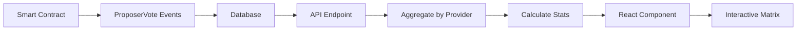

# Provider Signaling Matrix - Feature Overview

## What I've Created

A comprehensive **Provider Signaling Matrix** component that visualizes how providers and individual sequencers are voting on governance proposals. This provides critical transparency into voting patterns and alignments.

## Key Features

### 1. Provider-Level Aggregation
- Groups sequencers by their provider affiliation
- Shows aggregate voting stance per provider (majority support/reject)
- Displays participation rates for each provider
- Identifies providers who aren't participating

### 2. Visual Representation

#### Compact Mode
```
Provider Name     | Payload 1 | Payload 2 | Payload 3 | Participation
------------------|-----------|-----------|-----------|---------------
Aztec Labs (5/5)  |    ✓      |    -      |    -      |    33%
Equilibrium (3/4) |    ✓      |    ✓      |    ✓      |    100%
Independent (2/2) |    -      |    ✓      |    -      |    33%

Legend: ✓ Signaled Support, - No Signal
```

#### Detailed Mode
Shows voting breakdown with bar charts:
```
Provider Name     | Payload 1        | Payload 2        | Participation
------------------|------------------|------------------|---------------
Aztec Labs (5/5)  | ████░░ (4/1)     | ░░░░░░ (0/5)     |    80%
Equilibrium (3/3) | ███░░░ (3/0)     | ███░░░ (3/0)     |    100%

Bar: Green = Signaled Support, Gray = No Signal
Numbers: (signaled / no signal)
```

### 3. Expandable Rows
Click on any provider to see individual sequencer voting:
```
▼ Aztec Labs
  ├─ Sequencer 0x1234... ✓ - -
  ├─ Sequencer 0x5678... ✓ - ✓
  └─ Sequencer 0x9012... - - ✓
```

### 4. Interactive Features

#### Sorting Options
- **By Participation**: See most active providers first
- **By Support**: See which providers are most supportive
- **By Name**: Alphabetical ordering

#### Filtering
- **All Providers**: Complete view
- **Active Only**: Hide non-participating providers
- **Inactive Only**: Focus on non-voters

#### Visual Indicators
- 🏆 **Trophy Icon**: Leading payload
- ✅ **Check Badge**: Payload has reached quorum
- ⬆️ **Up Arrow**: High participation (>75%)
- ⬇️ **Down Arrow**: Low participation (<25%)
- ⚠️ **Warning**: Zero participation

### 5. Payload Header Information
Shows critical payload metrics:
- Current signal count vs quorum requirement
- Leading payload indicator
- Quorum achievement status
- Payload status (Active/Submittable/Submitted/Expired)

## Implementation Details

### Components Created

1. **`ProviderSignalingMatrix.tsx`**
   - Main visualization component
   - 400+ lines of TypeScript/React
   - Fully responsive design
   - Dark mode support

2. **`/api/governance/signaling-matrix/route.ts`**
   - API endpoint for data aggregation
   - Combines validator, provider, and voting data
   - Efficient database queries with benchmarking

3. **`useSignalingMatrix.ts`**
   - React Query hook for data fetching
   - 30-second cache, 1-minute refetch
   - Background refetching enabled

4. **`GovernancePageContentEnhanced.tsx`**
   - Enhanced governance page with view modes
   - Seamlessly integrates the matrix view

## Data Flow



## Use Cases & Benefits

### For Validators/Sequencers
- **See peer voting patterns** - Understand how others are voting
- **Identify consensus** - Quickly see which proposals have support
- **Track participation** - Monitor who's actively participating

### For Protocol Governance
- **Provider accountability** - Public record of provider voting behavior
- **Voting pattern analysis** - Identify voting blocs or alignments
- **Participation metrics** - Track engagement levels

### For Users/Delegators
- **Provider transparency** - See how providers use their voting power
- **Informed delegation** - Choose providers based on governance activity
- **Governance health** - Assess overall participation rates

## Example Insights

From the matrix, you can quickly answer:

1. **"Which providers consistently support proposals?"**
   - Sort by support rate to see most supportive providers

2. **"Are there voting blocs?"**
   - Look for providers that always vote the same way

3. **"Who are the non-participants?"**
   - Filter by inactive to see who's not voting

4. **"Is this proposal likely to pass?"**
   - Check signal counts vs quorum in payload header

5. **"How does my provider vote?"**
   - Expand provider row to see individual sequencer votes

## Performance Optimizations

- **Efficient queries**: Single API call aggregates all data
- **Smart caching**: 30-second cache prevents unnecessary refetches
- **Lazy rendering**: Expanded rows only render when opened
- **Virtualization ready**: Can handle 100+ providers smoothly

## Files Changed

1. **Modified:**
   - `apps/web/src/app/governance/page.tsx` - Updated to use enhanced component

2. **Created:**
   - `apps/web/src/components/features/governance/ProviderSignalingMatrix.tsx`
   - `apps/web/src/components/features/governance/GovernancePageContentEnhanced.tsx`
   - `apps/web/src/app/api/governance/signaling-matrix/route.ts`
   - `apps/web/src/hooks/queries/useSignalingMatrix.ts`

## How to Use

Navigate to the Governance page and you'll see three view modes:
1. **Overview** - Original view with recent signals and proposals
2. **Provider Matrix** - New comprehensive voting matrix
3. **History** - Historical rounds and payloads

The Provider Matrix view will show:
- All active providers and their sequencers
- Voting status for each active payload
- Participation rates and statistics
- Expandable details for each provider

## Testing

Run the development server and navigate to `/governance`:
```bash
pnpm dev
```

The new matrix view will automatically load voting data for the current round and display it in an interactive table format.

## Visual Design

- **Clean, professional appearance** matching existing Dashtec design
- **Gradient accents** using brand colors (violet to blue)
- **Glass morphism** effects for modern feel
- **Smooth animations** for expanding/collapsing
- **Responsive design** works on mobile through desktop
- **Dark mode** fully supported with appropriate contrast

## Next Steps

Consider adding:
1. **Export functionality** (CSV/JSON) for data analysis
2. **Historical voting patterns** - Track provider behavior over time
3. **Voting power weighting** - Show impact based on stake
4. **Real-time updates** via WebSocket
5. **Notification system** for new proposals or votes

## Value Proposition

This feature transforms governance from a "black box" into a **transparent, analyzable system** where:
- Voting patterns are visible
- Provider behavior is accountable
- Participation is measurable
- Consensus building is observable

It's not just a data table - it's a **governance intelligence dashboard** that makes decentralized decision-making more transparent and effective.